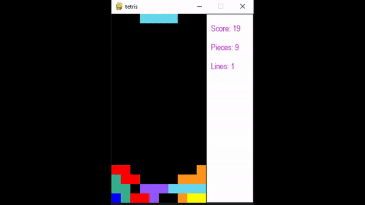

# Tetris

## What is it?
A pytorch implementation of Deep Q Learning to train an agent to play Tetris. \
The agent trained over 20000 episodes, with an epsilon decay rate of 0.999.
The idea is that the environment presents the agent with the set of all possible actions, and prompts it to choose the best one.

## Neural Network Architecture
The model used is a Deep Q Network, designed to process the state of a Tetris game and decide the best move. The architecture of the network follows: \

**Input Layer:**
- The input layer consists of 4 neurons, each representing a specific feature of the Tetris game state.\

**Hidden Layers:**

- First Linear Layer: This layer has 64 neurons and utilizes a Rectified Linear Unit (ReLU) activation function, providing the network with the ability to learn non-linear relationships
- Second Linear Layer: Similar to the first, this layer also features 64 neurons with ReLU activation. \

**Output Layer:**

- The final layer is a single neuron with a linear activation function. It outputs the Q-value, which represents the expected future rewards for a given action in a given state.
The network was trained using the Adam optimizer, with a LR of 1x10^{-3}. The Mean Squared Error function was used as the loss function.

## What does what?
* dqn.py: Contains the neural net code
* environment.py: Contains the tetris environment code
* training.py: Contains the training code 
* watch.py: runs the game \

If you want to redo the training process, run training.py. This takes a while. (~2 hours on an NVIDIA RTX 4070 Ti SUPER)\
If you just want to see the model play, run watch.py. The pretrained models are in the trained_models directory.

Thanks to [michiel-cox](https://github.com/michiel-cox) and [uvipen](https://github.com/uvipen) for inspiration.

